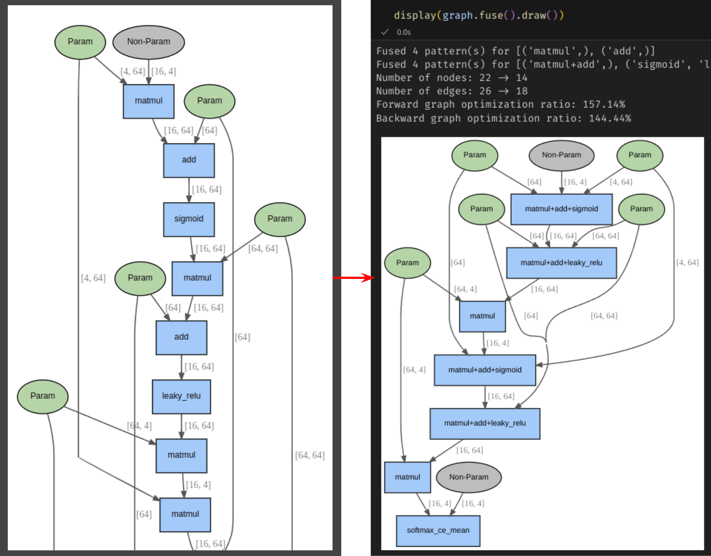

## `autograd`: “Lightweight Autograd Engine with Computation Graph Optimization”

> [NOTE]: This project is currently under dev.

#### 🔹 Overview
A minimal yet expressive autograd engine built entirely in **C++** with Python bindings, featuring **computation graph tracking and optimization**, and **efficient automatic back-propagation** with PyTorch-style APIs.


#### 🔹 Core Features (For details, see: '🧩 Demo Contents' section.)
- Lightweight, automatic Back-propagation based on zero-copied, dynamic **DAG-based Computation Graph** tracking for various tensor operations.
- **Shape-aware Computation Graph optimization**, and **visualization** including explicit visualization of Parameter, and Non-parameter leaf tensors, and shapes of intermediate tensors. ([`Graphviz`](https://graphviz.org/) is used for visualization)
   - 
- **Efficient Topological Backward Traversal** implemented in **C++ backend**
- **PyTorch-style API**: Own `Tensor`, `Function`, and `Optimizer` implementations provide PyTorch style APIs, such as `Tensor.backward()`. Also supports `no_grad()` context for inference.
   ```r
      loss = F.softmax_ce_mean.forward([out, y_train_onehot])
      loss.backward()
      optimizer.step()
      optimizer.zero_grad() 
   ```
- **Benchmark:** ~**1.2–1.3× faster than PyTorch for small-model workloads** (See section '📈 Benchmark Results Summary')


#### 🔹 Under Development
1. Enhanced `Function` API bindings between Python <--> C++ backend
2. Kernels for Additional operations such as `split`(chunk), `Conv`, `bmm` and `einsum` (with backward).
3. `Triton`-based PTX compilation for `CUDA` backend
4. Codegen for optimized graphs and automatic model compilation
5. More versatile fused operators
6. Low-latency dispatch table in C++ backend
7. Provide faster kernels for large tensors
8. Modulized parameter management support

---

### 🧩 Demo Contents ([DEMO](https://github.com/hkyoon94/autograd-from-scratch/blob/main/demo.ipynb))
1. **Dynamic Computation Graph Tracking, Optimization and Visualization**  
   - Tensor shape, and logical branch aware dynamic graph tracking, and optimizing the computation graphs based on chained subgraph fusion rules for arbitrary models.
2. **Training Benchmark**  
   - CPU backend benchmark vs. `PyTorch` showing correctness (accuracy ~0.96) and lower runtime overhead.
   - <span style="color: red;">[* NOTE]</span>: This benchmark uses small tensor workloads (≤64×64), where framework-level overhead becomes the dominant factor. The result demonstrates the lightweight design efficiency of the custom C++ autograd engine.

   - **Environment**
      - OS: Ubuntu 24.04.3 LTS (Linux)
      - Build: Clang 18.1.3 (C++17 standard) / NVCC 12.8.61 / Pybind11 v3.0.1
      - Python: 3.12.11
      - PyTorch: 2.8.0
      - CPU: Intel Core i7-14700KF
      - RAM: 32 GB DDR5

   #### 📈 Benchmark Results Summary
   | Framework | #Params | Accuracy | Forward total | Backward total | Speedup |
   |--------|----------|-----------|-----------|------------|------------|
   | PyTorch (Single-thread) | 4,736 | 0.95-0.96 | 3.82s | 10.41s | – |
   | `autograd` (C++) | 4,736 | 0.95-0.96 | **3.31s** | **8.00s** | **1.2-1.3x** |

   - Note: Under PyTorch’s default multi-threaded mode, \
   total runtime increased to **12.07s (forward)** and **32.49s (backward)** due to threading overhead on small tensor workloads.

---

### 🧠 Key Takeaway
> A **lightweight autograd engine** demonstrating correct graph-based backpropagation,  
> reduced runtime overhead, and extendability toward compiler-level optimizations.
