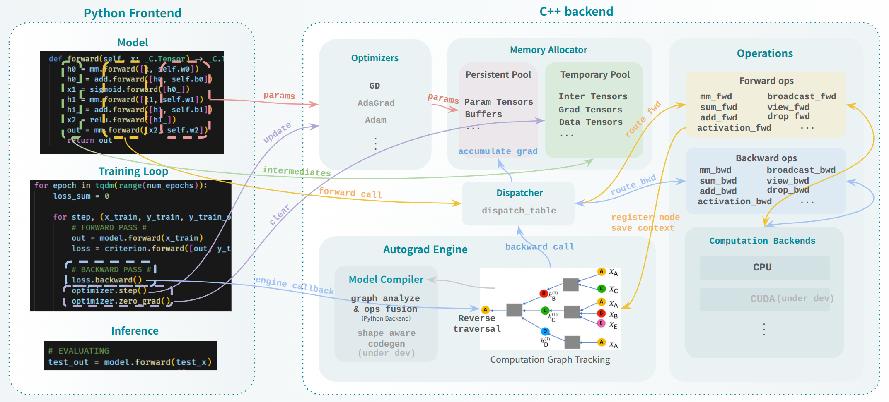
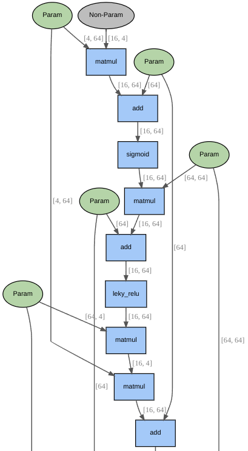

### `autograd`: “Lightweight Autograd Engine with Visualized Computation Graph and Automatic Backpropagation”

#### 🔹 Overview
A minimal yet expressive autograd engine built entirely in **C++** with Python bindings,  
featuring PyTorch-style APIs, graph visualization, and efficient automatic back-propagation.

#### 🔹 Core Features (For details, see: [DEMO](https://github.com/hkyoon94/autograd-from-scratch/blob/main/demo.ipynb))
- Lightweight, **DAG-based Computation Graph** tracking for versatile tensor operations, **including some fused forward / backward operators**.
- **Shape-aware Computation Graph visualization** via `Graphviz`
  - (including explicit visualization of Parameter, and Non-parameter leaf tensors.)
- **PyTorch-style API**: `Tensor`, `Optimizer`, `autograd.backward()`, also supports `no_grad()` context.
- **Efficient Topological Backward Traversal** implemented in **C++ backend**
- **Benchmark:** ~**1.2–1.3× faster than PyTorch for small-model workloads** (See section. #2)

#### 🔹 Under Development
1. Low-latency dispatch table in C++ backend
2. Enhanced `Function` API bindings between Python <--> C++ backend
3. Kernels for Additional operations such as `split`(chunk), `Conv`, `bmm` and `einsum` (with backward).
4. `Triton`-based PTX compilation for `CUDA` backend
5. Computation graph analyzer for operation fusion & model compilation
6. More versatile fused operators

---

### 🧩 Contents
1. **Dynamic Computation Graph Tracking and Visualization**  
   - Tensor shape, and logical branch aware dynamic graph tracking, providing visualized DAGs for arbitrary models.
     - 
2. **Training Benchmark**  
   - CPU backend benchmark vs. `PyTorch` showing correctness (accuracy ~0.96) and lower runtime overhead.
   - [* NOTE]: This benchmark uses small tensor workloads (≤64×64), where framework-level overhead becomes the dominant factor. The result demonstrates the lightweight design efficiency of the custom C++ autograd engine.

   - **Environment**
      - OS: Ubuntu 24.04.3 LTS (Linux)
      - Build: Clang 18.1.3 (C++17 standard) / NVCC 12.8.61 / Pybind11 v3.0.1
      - Python: 3.12.11
      - PyTorch: 2.8.0
      - CPU: Intel Core i7-14700KF
      - RAM: 32 GB DDR5

   #### 📈 Benchmark Results Summary
   | Framework | #Params | Accuracy | Forward total | Backward total | Speedup |
   |--------|----------|-----------|-----------|------------|------------|
   | PyTorch (Single-thread) | 4,736 | 0.95-0.96 | 3.82s | 10.41s | – |
   | `autograd` (C++) | 4,736 | 0.95-0.96 | **3.31s** | **8.00s** | **1.2-1.3x** |

   - Note: Under PyTorch’s default multi-threaded mode, \
   total runtime increased to **12.07s (forward)** and **32.49s (backward)** due to threading overhead on small tensor workloads.

---

### 🧠 Key Takeaway
> A **lightweight autograd engine** demonstrating correct graph-based backpropagation,  
> reduced runtime overhead, and extendability toward compiler-level optimizations.
